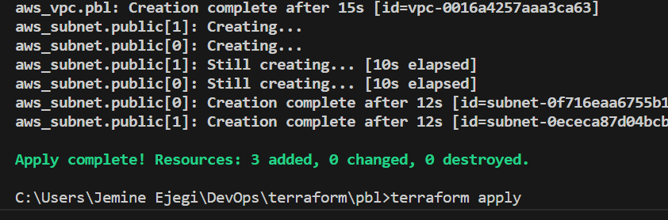
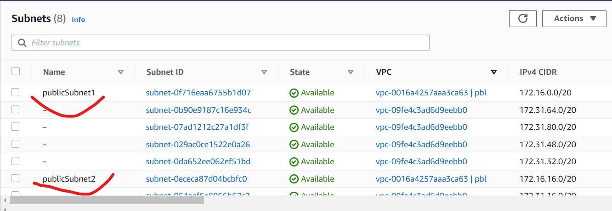
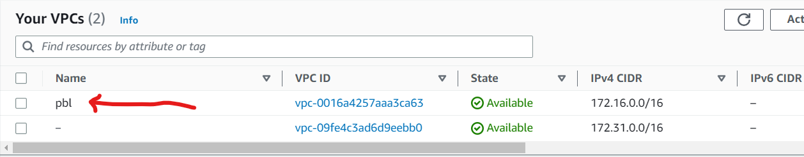

# Automate Infrastructure With IAC Using Terraform Part 1

**Step 1 - Setup AWS**
---

- Create a new IAM user on your account and assign administrative privileges to the account.

- Open the new user you created and head to security credentials. Once there, click on create access key. This is needed to grant access to your CLI to access your AWS account.

- Select the option in the screenshot below when creating the access key and copy the contents the security and access keys. You would need them shortly.

- Create an AWS S3 bucket which will be used to store the Terraform state file.

- Install the AWS CLI & Terraform on your local machine. After installing, run `aws configure` on your terminal. This will generate a prompt for you to insert the previously copied access and security keys into the CLI, along with the default region name for AWS and the default output format (json).

- After Terraform has been installed, create a new folder on your local machine to house the files terraform will create when it has begun working.

**Step 2 -  Configure Terraform File**
---

- Download the Terraform extension on your IDE.
  
- Create `main.tf` file and paste in the code below. This block of code basically decalres the provider and the command for the resource creation.

```
provider "aws" {
  region = "us-east-1"
}

# Create VPC
resource "aws_vpc" "main" {
  cidr_block                     = "172.16.0.0/16"
  enable_dns_support             = "true"
  enable_dns_hostnames           = "true"
}

```

- Run `terraform init` to initialize terraform in the folder. Next, run `terraform plan` to display the actions terraform will take.

- Create a new file called `variables.tf` which will hold the variables that will be used by terraform. Variables are the go-to method for using terraform as they make the entire config look professional compared to hard coding everything.

- Insert the following into the newly created `variables.tf`

```
variable "region" {
      default = "us-east-1"
}

variable "vpc_cidr" {
    default = "172.16.0.0/16"
}

variable "enable_dns_support" {
    default = "true"
}

variable "enable_dns_hostnames" {
    default ="true" 
}

  variable "preferred_number_of_public_subnets" {
      default = null
}
```

- Create another file called `terraform.tfvars` and paste the code below. *(The `tfvars` file is basically where terraform looks to load variable values that have been called somewhere. Whenever you declare a variable in the `main.tf` terraform checks the `tfvars` to see what value has been assigned to the variable).*

```
region = "us-east-1"

vpc_cidr = "172.16.0.0/16" 

enable_dns_support = "true" 

enable_dns_hostnames = "true"  

preferred_number_of_public_subnets = 2
```

- Ensure the `main.tf` is looking like this:

```
#Get list of AZ
data "aws_availability_zones" "available" {
  state = "available"
}

provider "aws" {
    region = var.region
}

# Create VPC
resource "aws_vpc" "pbl" {
    cidr_block = var.vpc_cidr
    enable_dns_hostnames = var.enable_dns_support
    enable_dns_support = var.enable_dns_hostnames
    tags = {
      Name = "pbl"
    }
}

# Create public subnets
resource "aws_subnet" "public" {
  count = var.preferred_number_of_public_subnets == null ? length(data.aws_availability_zones.available.names) : var.preferred_number_of_public_subnets
  vpc_id = aws_vpc.pbl.id
  cidr_block = cidrsubnet(var.vpc_cidr, 4, count.index)
  map_public_ip_on_launch = true
  availability_zone = data.aws_availability_zones.available.names[count.index]
  tags = {
    Name = "publicSubnet${count.index + 1}"
  }
}
```
*Notice where the count is used for the name of the subnet? That was done to prevent the deployed subnets have the same name. When they are now deployed, they will have different names for easy identification*

**Step 3 - Run Terraform**
---

- Run `terraform plan` to confirm that everything is set up correctly and there aren't any errors. After that, run `terraform apply` to start the deployment.



- Go to your AWS account and confirm if the VPC and subnets were created.





- Run `terraform destroy` to destroy the infrastructure.

**Project Completed Successfully!**
